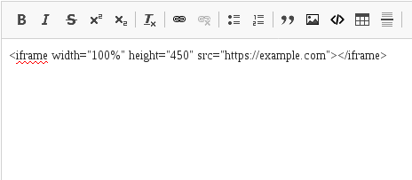

# CKEditor Embed Code #

A CKEditor plugin and filter for Drupal 8 to safely embed code like an iframe.

## Example ##

Using the CKEditor plugin you can enter the code to embed:


This is the resulting HTML source:

```
<div class="embedcode">&lt;iframe width="100%" height="450" src="https://example.com"&gt;&lt;/a&gt;</div>
```

And this is what the editor sees in the WYSIWYG textarea:



If this was rendered directly without any filter, the code would be seen as text in the page. We need to enable the "Embed Code Filter" to render an iframe instead.

In Configuration > Text formats and editors:


This filters creates the iframe HTML node, setting the src attribute, a style to correctly display the width and height, and the [sandbox attribute](https://html.spec.whatwg.org/multipage/iframe-embed-object.html#attr-iframe-sandbox) with the values: 'allow-same-origin allow-forms allow-scripts'
